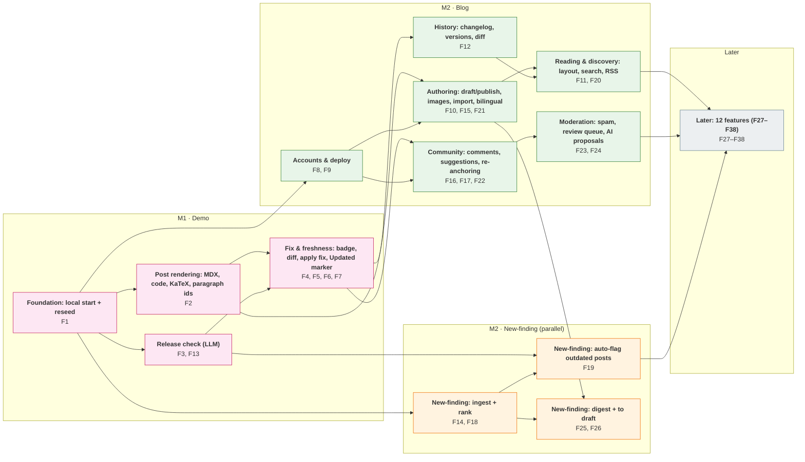

# Roadmap: Tech Blog Correctness (full product)

Source: [hackathon-brief.md](../../hackathon-brief.md) full feature map + [scope/features.md](scope/features.md) + [scope/cut.md](scope/cut.md). AC ids = [specs/spec.md](specs/spec.md) Build table (`B<n>.<k>` = item B<n>, criterion k). Plan each feature with `/bach:pr-team roadmap.md#F<n>`; one feature = one pr-team run (1–4 small PRs). Mark ✅ when its PRs are merged. Previous 79-feature version: [roadmap.v1.md](roadmap.v1.md); old → new ids at the end.

## Milestones

- **M1 · Demo** (code freeze Day 2 16:00, script: [scope/demo.md](scope/demo.md), spec: [specs/spec.md](specs/spec.md)): F1–F7. Fake items from cut.md are M2 features faked in M1 via seed/cache (noted per feature). Hand-made demo artifacts: see "M1 demo prep (not features)".
- **M2 · Blog track**: F8–F13, F15–F17, F20–F24 — auth + roles + seeded users, deploy, authoring, reading/search/follow, bilingual EN + VI, comments, suggestions with credited revisions, re-anchoring, changelog/history, spam, review queue, deeper release check.
- **M2 · NF track** (new-finding service, parallel): F14, F18, F19, F25, F26 — ingest → rank → daily EN+VI digest + feedback → item→draft, auto-flag on new releases. Starts right after M1 (needs only the local stack and the post model) and runs alongside the blog waves.
- **Later**: F27–F38 — settings/theme, payments/multi-tenant/mobile app, authoring assists (voice, draft review, linting), staleness signals + dashboard, reader flags, reputation, notifications, moderation tools, link hygiene, motion video, export/integrations.

---

# M1 · Demo

## F1 · One-command local start + reseed
- Status: ⬜
- Milestone: M1
- Depends on: none
- AC: spec.md "Done when" (app starts locally with one command)
- Goal: single command brings up FastAPI + Postgres + React and loads a seed set via a reusable seed/reseed command (backs "Reset demo").

## F2 · Markdown/MDX rendering with code highlight, KaTeX, paragraph ids
- Status: ⬜
- Milestone: M1
- Depends on: F1
- AC: B2.1, B2.2, B2.3, B2.4
- Goal: seeded post renders Lil'Log-style with stable paragraph ids matching backend.

## F3 · Check post against release note (LLM flag of outdated paragraphs)
- Status: ⬜
- Milestone: M1
- Depends on: F1
- AC: B1.1, B1.2, B1.3, B1.4, B1.5
- Goal: paste release URL/text → Claude returns flagged paragraphs + reason + source line + fix; cached fallback. Core differentiator.

## F4 · Reader-visible freshness badge
- Status: ⬜
- Milestone: M1
- Depends on: F2, F3
- AC: B3.1, B3.2, B3.4
- Goal: amber "May be outdated" per paragraph with reason + source; post badge shows worst state.

## F5 · Inline diff preview of fix vs original
- Status: ⬜
- Milestone: M1
- Depends on: F2, F3
- AC: B5.1, B5.2, B5.3
- Goal: whole-paragraph `<del>`/`<ins>` popover before accept.

## F6 · Accepted fix applies to post body
- Status: ⬜
- Milestone: M1
- Depends on: F4, F5
- AC: B4.1, B4.2, B4.4, B4.5, B3.3
- Goal: Accept persists new text, updates in place, badge flips green "Verified"; Reset demo.

## F7 · Inline paragraph "Updated <date>" marker
- Status: ⬜
- Milestone: M1
- Depends on: F6
- AC: B4.3
- Goal: accepted paragraph shows dated update marker.

# M2 · Blog track

## F8 · Sign-in, roles, OAuth + multi-role seed users and posts
- Status: ⬜
- Milestone: M2 · Blog (M1: one seeded account logged in)
- Depends on: F1
- AC: none yet
- Goal: guest/member/author-admin roles, GitHub OAuth for readers, seeded users across roles + a few license-checked real posts.

## F9 · Deploy
- Status: ⬜
- Milestone: M2 · Blog
- Depends on: F1
- AC: none yet
- Goal: app reachable on a public URL.

## F10 · Illustrations + import posts from Markdown/repo
- Status: ⬜
- Milestone: M2 · Blog
- Depends on: F2
- AC: none yet
- Goal: images/diagrams in posts; bring existing Hugo/Markdown posts in.

## F11 · Reading layout: TOC, anchored headings, paragraph links, mobile
- Status: ⬜
- Milestone: M2 · Blog
- Depends on: F2
- AC: none yet
- Goal: TOC sidebar, anchored headings, per-paragraph citation link, comfortable desktop + mobile reading.

## F12 · Changelog, version history + restore, diff between versions
- Status: ⬜
- Milestone: M2 · Blog
- Depends on: F6
- AC: none yet
- Goal: auto-appended public changelog per accepted fix, post revisions with restore, compare two revisions.

## F13 · Deeper release check: claim extraction + outdated code/versions
- Status: ⬜
- Milestone: M2 · Blog (M1: folded into F3 prompt)
- Depends on: F3
- AC: none yet
- Goal: extract time-sensitive claims (versions, prices, model names) and check code/version references.

## F15 · Authoring: draft, preview, publish, edit + editor + series/categories
- Status: ⬜
- Milestone: M2 · Blog
- Depends on: F2, F8
- AC: none yet
- Goal: author post lifecycle with in-app Markdown editor (live preview), series and categories.

## F16 · Inline comments: select-text comment, margin view, per-paragraph thread
- Status: ⬜
- Milestone: M2 · Blog
- Depends on: F2, F8
- AC: none yet
- Goal: span-anchored comments shown beside the paragraph, threaded per paragraph.

## F17 · Reader suggestions → author decision → credited revision
- Status: ⬜
- Milestone: M2 · Blog (M1: one seeded suggestion, Accept only via F6)
- Depends on: F5, F6, F8
- AC: none yet
- Goal: reader selects span and proposes replacement; author accepts/declines, reader withdraws; accepted revision credits contributor.

## F20 · Find and follow: search + RSS / "what changed" feed
- Status: ⬜
- Milestone: M2 · Blog
- Depends on: F12, F15
- AC: none yet
- Goal: search across posts; feed of new and updated posts.

## F21 · Bilingual EN + VI UI and posts
- Status: ⬜
- Milestone: M2 · Blog
- Depends on: F15
- AC: none yet
- Goal: i18n UI (EN/VI switch); one post with two language versions.

## F22 · Anchor re-anchoring + orphan detection
- Status: ⬜
- Milestone: M2 · Blog
- Depends on: F6, F16
- AC: none yet
- Goal: comments/suggestions follow moved or changed text; surface anchors whose text was deleted.

## F23 · Spam filter (rules + LLM) + rate limiting
- Status: ⬜
- Milestone: M2 · Blog
- Depends on: F16, F17
- AC: none yet
- Goal: keep comments and proposals clean.

## F24 · Author review queue + severity ranking + AI-drafted proposals
- Status: ⬜
- Milestone: M2 · Blog (M1: fix text carried in F3 response)
- Depends on: F3, F17
- AC: none yet
- Goal: one queue for reader suggestions, flags and AI fixes (never auto-publish), sorted by impact.

# M2 · NF track (new-finding service)

## F14 · Scheduled ingest from followed sources + hand-saved links
- Status: ⬜
- Milestone: M2 · NF track
- Depends on: F1
- AC: none yet
- Goal: ingest Lil'Log, Knowbie, blogs, newsletters, release notes, papers, YouTube (link + summary only) plus links saved by hand.

## F18 · Filter and rank findings
- Status: ⬜
- Milestone: M2 · NF track
- Depends on: F14
- AC: none yet
- Goal: relevance, novelty vs author's posts, source quality, dedupe, no hype.

## F19 · Auto-flag posts a new release makes outdated
- Status: ⬜
- Milestone: M2 · NF track
- Depends on: F3, F14
- AC: none yet
- Goal: run the F3 check automatically on ingested release notes (auto-watch release feeds).

## F25 · Daily EN + VI digest + feedback tunes ranking
- Status: ⬜
- Milestone: M2 · NF track
- Depends on: F18
- AC: none yet
- Goal: 2–3 items/day in EN + VI (what's new, why it matters, summary, source link); useful / already known / skip feeds ranking.

## F26 · One click: finding → draft post / TIL
- Status: ⬜
- Milestone: M2 · NF track
- Depends on: F15, F25
- AC: none yet
- Goal: turn a digest item into a draft post or TIL.

# Later

## F27 · Settings: light/dark theme, profile, email preferences
- Status: ⬜
- Milestone: Later
- Depends on: F8
- AC: none yet
- Goal: theme toggle (M1 is light only), profile editing, notification prefs.

## F28 · Platform scale-out: payments, multi-tenant, native mobile app
- Status: ⬜
- Milestone: Later
- Depends on: F8, F9
- AC: none yet
- Goal: paid tier, several authors' blogs on one instance, mobile client.

## F29 · Authoring assists: voice → draft, draft review mode, prose linting
- Status: ⬜
- Milestone: Later
- Depends on: F15, F16
- AC: none yet
- Goal: dictate a draft, pre-publish inline feedback on drafts, Vale-style checks in the editor.

## F30 · Age-based staleness: last-reviewed date + banner after N days
- Status: ⬜
- Milestone: Later
- Depends on: F7, F8
- AC: none yet
- Goal: post-level last-reviewed date; author-configurable threshold; "may be outdated" banner after N days.

## F31 · Reader flags: report error, "this is outdated" vote, correction types
- Status: ⬜
- Milestone: Later
- Depends on: F4, F8, F17
- AC: none yet
- Goal: one-click reader flags on post/paragraph, typed as typo / factual / outdated / missing context.

## F32 · Contributor credit: proposal status, reactions, reputation + badge
- Status: ⬜
- Milestone: Later
- Depends on: F16, F17
- AC: none yet
- Goal: proposer sees pending/accepted/declined; react to comments/suggestions; reputation and contributor profile.

## F33 · Notifications: author alerts, notify proposer, subscribe to post, digest
- Status: ⬜
- Milestone: Later
- Depends on: F8, F17, F20
- AC: none yet
- Goal: email/webhook on new feedback, proposer notified on decision, readers subscribe to correction notices, batched digest.

## F34 · Moderation tools + anonymous suggestions
- Status: ⬜
- Milestone: Later
- Depends on: F16, F17, F23
- AC: none yet
- Goal: hide/delete/block; suggest without account behind the spam guard.

## F35 · Link hygiene: outbound link checker + mark section superseded
- Status: ⬜
- Milestone: Later
- Depends on: F2
- AC: none yet
- Goal: detect broken links; point a section to a newer post.

## F36 · Post → short motion video
- Status: ⬜
- Milestone: Later
- Depends on: F2
- AC: none yet
- Goal: shareable short video from a post.

## F37 · Export + integrations: JSON/MD export, Git PR export, embeddable widget
- Status: ⬜
- Milestone: Later
- Depends on: F6, F16, F17
- AC: none yet
- Goal: no lock-in export, push accepted fixes to source repo, Giscus-style embed for static blogs.

## F38 · Author insights: staleness score + dashboard, paragraph analytics, feedback counts
- Status: ⬜
- Milestone: Later
- Depends on: F4, F16, F17, F19, F31
- AC: none yet
- Goal: per-post score from age, reader flags and release flags; rank posts by risk; paragraph and open/resolved feedback stats.

---

## M1 demo prep (not features)

Hand-made for the demo; not pr-team features, no ✅. Do alongside W1–W2.

- **D1 · Demo seed fixture content** (was old F72; the reseed mechanism lives in F1): one LLM-API usage post, one real Anthropic release note (pre-cached), one seeded reader suggestion, cached Claude response. Loaded by F1's seed command; needed for B1.3, B1.4, B4.5.
- **D2 · Demo static slides** (was old F74): hook quote (beat 1) + "Today" Hugo/Giscus mock (beat 2).

---

## Dependency graph

Features are grouped into clusters; arrows connect clusters (an arrow A → B means some feature in B depends on a feature in A; redundant transitive arrows are omitted). Exact per-feature dependencies are in each feature's "Depends on".

| Cluster | Features | Milestone |
|---|---|---|
| C1 · Foundation: local start + reseed | F1 | M1 · Demo |
| C2 · Post rendering: MDX, code, KaTeX, paragraph ids | F2 | M1 · Demo |
| C3 · Release check (LLM) | F3, F13 | M1 · Demo |
| C4 · Fix & freshness: badge, diff, apply fix, Updated marker | F4, F5, F6, F7 | M1 · Demo |
| C5 · Accounts & deploy | F8, F9 | M2 · Blog |
| C6 · Authoring: draft/publish, images, import, bilingual | F10, F15, F21 | M2 · Blog |
| C7 · Reading & discovery: layout, search, RSS | F11, F20 | M2 · Blog |
| C8 · History: changelog, versions, diff | F12 | M2 · Blog |
| C9 · Community: comments, suggestions, re-anchoring | F16, F17, F22 | M2 · Blog |
| C10 · Moderation: spam, review queue, AI proposals | F23, F24 | M2 · Blog |
| C11 · New-finding: ingest + rank | F14, F18 | M2 · New-finding (parallel) |
| C12 · New-finding: auto-flag outdated posts | F19 | M2 · New-finding (parallel) |
| C13 · New-finding: digest + to draft | F25, F26 | M2 · New-finding (parallel) |
| C14 · Later: 12 features (F27–F38) | F27, F28, F29, F30, F31, F32, F33, F34, F35, F36, F37, F38 | Later |

## Waves

Waves run in order. M2 waves start after M1 is done; the M2 Blog and NF tracks share wave numbers and run side by side (one tmux session per feature). Later waves start after M2. Features in one wave number (across both tracks) are independent and can run in parallel.

| Wave | Features |
|---|---|
| W1 (M1) | F1 |
| W2 (M1) | F2, F3 |
| W3 (M1) | F4, F5 |
| W4 (M1) | F6 |
| W5 (M1) | F7 |
| W6 (M2 · Blog) | F8, F9, F10, F11, F12, F13 |
| W6 (M2 · NF track) | F14 |
| W7 (M2 · Blog) | F15, F16, F17 |
| W7 (M2 · NF track) | F18, F19 |
| W8 (M2 · Blog) | F20, F21, F22, F23, F24 |
| W8 (M2 · NF track) | F25 |
| W9 (M2 · NF track) | F26 |
| W10 (Later) | F27, F28, F29, F30, F31, F32, F33, F34, F35, F36, F37 |
| W11 (Later) | F38 |

## Mapping old F → new F

| Old | Old name | New |
|---|---|---|
| F1 | One-command local start | F1 |
| F2 | Sign-in and roles + OAuth | F8 |
| F3 | Deploy | F9 |
| F4 | Bilingual EN + VI | F21 |
| F5 | Configurable stale threshold | F30 |
| F6 | Light/dark theme toggle | F27 |
| F7 | Profile + email preferences | F27 |
| F8 | Payments | F28 |
| F9 | Multi-tenant | F28 |
| F10 | Native mobile app | F28 |
| F11 | MDX render + KaTeX + paragraph ids | F2 |
| F12 | Illustrations in posts | F10 |
| F13 | Draft, preview, publish, edit | F15 |
| F14 | Markdown editor with live preview | F15 |
| F15 | Series and categories | F15 |
| F16 | Import posts from Markdown/repo | F10 |
| F17 | Draft review mode | F29 |
| F18 | Create content by voice | F29 |
| F19 | Prose / terminology linting | F29 |
| F20 | Freshness badge | F4 |
| F21 | "Updated <date>" marker | F7 |
| F22 | TOC sidebar + anchored headings | F11 |
| F23 | Search | F20 |
| F24 | Desktop + mobile reading | F11 |
| F25 | RSS / "what changed" feed | F20 |
| F26 | Subscribe to post | F33 |
| F27 | Paragraph citation link | F11 |
| F28 | Last-reviewed date | F30 |
| F29 | Staleness banner after N days | F30 |
| F30 | Per-post staleness score | F38 |
| F31 | Staleness dashboard | F38 |
| F32 | Outbound link checker | F35 |
| F33 | Mark section superseded | F35 |
| F34 | Inline diff preview | F5 |
| F35 | Accepted fix applies | F6 |
| F36 | Reader "Suggest edit" | F17 |
| F37 | Author accept/decline/withdraw | F17 |
| F38 | Select-text inline comment | F16 |
| F39 | Margin view of comments | F16 |
| F40 | Per-paragraph thread | F16 |
| F41 | Reactions / upvotes | F32 |
| F42 | Re-anchoring | F22 |
| F43 | Orphaned-anchor detection | F22 |
| F44 | Reader credit (credited revision) | F17 |
| F45 | Public changelog | F12 |
| F46 | Version history + restore | F12 |
| F47 | Diff between versions | F12 |
| F48 | Proposal status visible to reader | F32 |
| F49 | Notify proposer | F33 |
| F50 | Correction types taxonomy | F31 |
| F51 | "Report error" flag | F31 |
| F52 | Reader outdated vote | F31 |
| F53 | Anonymous suggestions | F34 |
| F54 | Reputation + contributor profile | F32 |
| F55 | Spam filtering + rate limiting | F23 |
| F56 | Author review queue | F24 |
| F57 | Severity ranking | F24 |
| F58 | Admin moderation tools | F34 |
| F59 | Email/webhook notification | F33 |
| F60 | Notification digest | F33 |
| F61 | Check post against release note | F3 |
| F62 | AI-drafted correction proposals | F24 |
| F63 | Claim-level staleness extraction | F13 |
| F64 | Outdated code / versions | F13 |
| F65 | Scheduled ingest | F14 |
| F66 | Filter and rank findings | F18 |
| F67 | Daily digest EN + VI | F25 |
| F68 | Feedback tunes ranking | F25 |
| F69 | Item → draft / TIL | F26 |
| F70 | Auto-flag posts on new release | F19 |
| F71 | Post → motion video | F36 |
| F72 | Demo seed fixture | F1 (reseed mechanism; fixture content → D1) |
| F73 | Seed users across roles + real posts | F8 |
| F74 | Demo static slides | D2 (demo prep, not a feature) |
| F75 | Paragraph analytics | F38 |
| F76 | Per-post feedback counts | F38 |
| F77 | Open data export | F37 |
| F78 | Export corrections to Git PR | F37 |
| F79 | Embeddable widget | F37 |
