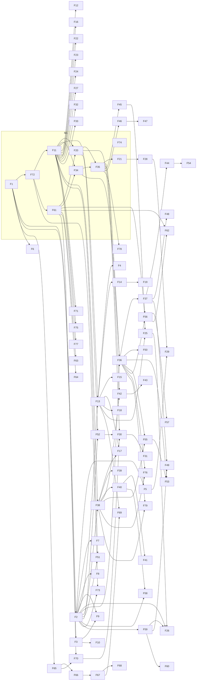

# Roadmap: Tech Blog Correctness (full product)

Source: [hackathon-brief.md](../../hackathon-brief.md) full feature map + [scope/features.md](scope/features.md) + [scope/cut.md](scope/cut.md). AC ids = [specs/spec.md](specs/spec.md) Build table (`B<n>.<k>` = item B<n>, criterion k). Plan each feature with `/bach:pr-team roadmap.md#F<n>`. Mark ✅ when its PRs are merged.

## Milestones

- **M1 · Demo** (code freeze Day 2 16:00, script: [scope/demo.md](scope/demo.md), spec: [specs/spec.md](specs/spec.md)): F1, F74, F72, F11, F61, F20, F34, F35, F21. Fake items from cut.md are M2+ features faked in M1 via seed/cache (noted per feature).
- **M2 · Real blog core**: auth + roles, deploy, authoring flow, TOC/search/mobile, reader suggestions + inline comments + credited revisions, changelog/history, spam + review queue, multi-role seed.
- **M3 · New-finding service**: ingest → rank → daily EN+VI digest → feedback → item→draft, auto-flag on new releases.
- **Later**: always-later items (settings, theme, i18n, payments, mobile app, multi-tenant, integrations), staleness analytics, reputation, notifications, sharing video.

---

# Platform

## F1 · One-command local start
- Status: ⬜
- Milestone: M1
- Depends on: none
- AC: spec.md "Done when" (app starts locally with one command)
- Goal: `make`/single command brings up FastAPI + Postgres + React for the demo.

## F2 · Sign-in and roles (guest, member, author/admin) + OAuth reader identity
- Status: ⬜
- Milestone: M2 (M1: one seeded account logged in)
- Depends on: F1
- AC: TBD (plan with pr-team)
- Goal: real auth and role-based permissions, GitHub OAuth for readers.

## F3 · Deploy
- Status: ⬜
- Milestone: M2
- Depends on: F1
- AC: TBD (plan with pr-team)
- Goal: app reachable on a public URL.

## F4 · Bilingual EN + VI UI and posts
- Status: ⬜
- Milestone: Later
- Depends on: F13
- AC: TBD (plan with pr-team)
- Goal: i18n UI; one post with two language versions.

## F5 · Settings: configurable stale threshold per post
- Status: ⬜
- Milestone: Later
- Depends on: F2
- AC: TBD (plan with pr-team)
- Goal: author sets N days after which a post counts as aging.

## F6 · Light/dark theme toggle
- Status: ⬜
- Milestone: Later
- Depends on: F1
- AC: TBD (plan with pr-team)
- Goal: dark mode + toggle (M1 demo is light only).

## F7 · Profile editing and email preferences
- Status: ⬜
- Milestone: Later
- Depends on: F2
- AC: TBD (plan with pr-team)
- Goal: users edit profile and notification prefs.

## F8 · Payments
- Status: ⬜
- Milestone: Later
- Depends on: F2
- AC: TBD (plan with pr-team)
- Goal: paid tier / support payments.

## F9 · Multi-tenant
- Status: ⬜
- Milestone: Later
- Depends on: F2, F3
- AC: TBD (plan with pr-team)
- Goal: host several authors' blogs on one instance.

## F10 · Native mobile app
- Status: ⬜
- Milestone: Later
- Depends on: F3
- AC: TBD (plan with pr-team)
- Goal: mobile app client.

# Authoring

## F11 · Markdown/MDX rendering with code highlight, KaTeX, paragraph ids
- Status: ⬜
- Milestone: M1
- Depends on: F72
- AC: B2.1, B2.2, B2.3, B2.4
- Goal: seeded post renders Lil'Log-style with stable paragraph ids matching backend.

## F12 · Illustrations in posts (images/diagrams)
- Status: ⬜
- Milestone: M2
- Depends on: F11
- AC: TBD (plan with pr-team)
- Goal: images and diagrams alongside code + math.

## F13 · Draft, preview, publish, edit posts
- Status: ⬜
- Milestone: M2
- Depends on: F2, F11
- AC: TBD (plan with pr-team)
- Goal: author post lifecycle.

## F14 · Markdown editor with live preview
- Status: ⬜
- Milestone: M2
- Depends on: F13
- AC: TBD (plan with pr-team)
- Goal: in-app editor.

## F15 · Series and categories
- Status: ⬜
- Milestone: M2
- Depends on: F13
- AC: TBD (plan with pr-team)
- Goal: group posts into series and categories.

## F16 · Import posts from Markdown files / repo
- Status: ⬜
- Milestone: M2
- Depends on: F11
- AC: TBD (plan with pr-team)
- Goal: bring existing Hugo/Markdown posts in.

## F17 · Draft review mode with inline comments
- Status: ⬜
- Milestone: Later
- Depends on: F13, F38
- AC: TBD (plan with pr-team)
- Goal: pre-publish feedback on drafts.

## F18 · Create content by voice (voice → draft)
- Status: ⬜
- Milestone: Later
- Depends on: F13
- AC: TBD (plan with pr-team)
- Goal: dictate, get a draft post.

## F19 · Prose / terminology linting
- Status: ⬜
- Milestone: Later
- Depends on: F14
- AC: TBD (plan with pr-team)
- Goal: Vale-style checks in the editor.

# Reading

## F20 · Reader-visible freshness badge
- Status: ⬜
- Milestone: M1
- Depends on: F11, F61
- AC: B3.1, B3.2, B3.4
- Goal: amber "May be outdated" per paragraph with reason + source; post badge shows worst state.

## F21 · Inline paragraph "Updated <date>" marker
- Status: ⬜
- Milestone: M1
- Depends on: F35
- AC: B4.3
- Goal: accepted paragraph shows dated update marker.

## F22 · Post page TOC sidebar + anchored headings
- Status: ⬜
- Milestone: M2
- Depends on: F11
- AC: TBD (plan with pr-team)
- Goal: navigate long posts.

## F23 · Search across posts
- Status: ⬜
- Milestone: M2
- Depends on: F11
- AC: TBD (plan with pr-team)
- Goal: find content again.

## F24 · Comfortable reading on desktop and mobile
- Status: ⬜
- Milestone: M2
- Depends on: F11
- AC: TBD (plan with pr-team)
- Goal: responsive reading layout.

## F25 · Follow new content: RSS / "what changed" feed
- Status: ⬜
- Milestone: M2
- Depends on: F13, F45
- AC: TBD (plan with pr-team)
- Goal: feed of new and updated posts.

## F26 · Subscribe to a post for correction notices
- Status: ⬜
- Milestone: Later
- Depends on: F2, F25, F59
- AC: TBD (plan with pr-team)
- Goal: readers get notified when a post is corrected.

## F27 · Paragraph citation / share link
- Status: ⬜
- Milestone: M2
- Depends on: F11
- AC: TBD (plan with pr-team)
- Goal: link to an exact paragraph.

## F28 · Last-reviewed date on post
- Status: ⬜
- Milestone: Later
- Depends on: F21
- AC: TBD (plan with pr-team)
- Goal: post-level last reviewed/updated date.

## F29 · Staleness banner after N days
- Status: ⬜
- Milestone: Later
- Depends on: F5, F28
- AC: TBD (plan with pr-team)
- Goal: age-based "may be outdated" banner.

## F30 · Per-post staleness score
- Status: ⬜
- Milestone: Later
- Depends on: F20, F52, F70
- AC: TBD (plan with pr-team)
- Goal: score from age, reader flags, release flags.

## F31 · Staleness dashboard
- Status: ⬜
- Milestone: Later
- Depends on: F30
- AC: TBD (plan with pr-team)
- Goal: author ranks posts by risk.

## F32 · Outbound link checker
- Status: ⬜
- Milestone: Later
- Depends on: F11
- AC: TBD (plan with pr-team)
- Goal: detect broken links.

## F33 · Mark section superseded
- Status: ⬜
- Milestone: Later
- Depends on: F11
- AC: TBD (plan with pr-team)
- Goal: point a section to a newer post.

# Community

## F34 · Inline diff preview of fix vs original
- Status: ⬜
- Milestone: M1
- Depends on: F11, F61
- AC: B5.1, B5.2, B5.3
- Goal: whole-paragraph `<del>`/`<ins>` popover before accept.

## F35 · Accepted fix applies to post body
- Status: ⬜
- Milestone: M1
- Depends on: F20, F34
- AC: B4.1, B4.2, B4.4, B4.5, B3.3
- Goal: Accept persists new text, updates in place, badge flips green "Verified"; Reset demo.

## F36 · Reader "Suggest edit" on a text span
- Status: ⬜
- Milestone: M2 (M1: one seeded suggestion)
- Depends on: F2, F34, F35
- AC: TBD (plan with pr-team)
- Goal: reader selects text, proposes replacement.

## F37 · Author accept / decline / withdraw
- Status: ⬜
- Milestone: M2 (M1: Accept only, via F35)
- Depends on: F36
- AC: TBD (plan with pr-team)
- Goal: full proposal decision flow.

## F38 · Select-text inline comment
- Status: ⬜
- Milestone: M2
- Depends on: F2, F11
- AC: TBD (plan with pr-team)
- Goal: comment anchored to a span.

## F39 · Margin view of comments
- Status: ⬜
- Milestone: M2
- Depends on: F38
- AC: TBD (plan with pr-team)
- Goal: comments beside the paragraph.

## F40 · Per-paragraph discussion thread
- Status: ⬜
- Milestone: M2
- Depends on: F38
- AC: TBD (plan with pr-team)
- Goal: threaded discussion per paragraph.

## F41 · Reactions / upvotes
- Status: ⬜
- Milestone: Later
- Depends on: F40
- AC: TBD (plan with pr-team)
- Goal: react to comments and suggestions.

## F42 · Anchors surviving edits (re-anchoring)
- Status: ⬜
- Milestone: M2
- Depends on: F35, F38
- AC: TBD (plan with pr-team)
- Goal: comments/suggestions follow moved or changed text.

## F43 · Orphaned-anchor detection
- Status: ⬜
- Milestone: M2
- Depends on: F42
- AC: TBD (plan with pr-team)
- Goal: surface anchors whose text was deleted.

## F44 · Reader credit on accepted correction (credited revision)
- Status: ⬜
- Milestone: M2
- Depends on: F37
- AC: TBD (plan with pr-team)
- Goal: approve → revision credits the contributor.

## F45 · Public changelog per correction
- Status: ⬜
- Milestone: M2
- Depends on: F35
- AC: TBD (plan with pr-team)
- Goal: auto-appended changelog entry per accepted fix.

## F46 · Version history + restore
- Status: ⬜
- Milestone: M2
- Depends on: F35
- AC: TBD (plan with pr-team)
- Goal: post revisions with restore.

## F47 · Diff between post versions
- Status: ⬜
- Milestone: Later
- Depends on: F46
- AC: TBD (plan with pr-team)
- Goal: compare any two revisions.

## F48 · Proposal status visible to reader
- Status: ⬜
- Milestone: Later
- Depends on: F37
- AC: TBD (plan with pr-team)
- Goal: pending/accepted/declined shown to proposer.

## F49 · Notify proposer
- Status: ⬜
- Milestone: Later
- Depends on: F37, F59
- AC: TBD (plan with pr-team)
- Goal: notify on accept/decline.

## F50 · Correction types taxonomy
- Status: ⬜
- Milestone: Later
- Depends on: F36
- AC: TBD (plan with pr-team)
- Goal: typo / factual / outdated / missing context.

## F51 · "Report error" flag
- Status: ⬜
- Milestone: Later
- Depends on: F2, F11
- AC: TBD (plan with pr-team)
- Goal: reader flags post or paragraph.

## F52 · Reader "this is outdated" vote
- Status: ⬜
- Milestone: Later
- Depends on: F2, F20
- AC: TBD (plan with pr-team)
- Goal: one-click outdated vote feeding freshness.

## F53 · Anonymous suggestions
- Status: ⬜
- Milestone: Later
- Depends on: F36, F55
- AC: TBD (plan with pr-team)
- Goal: suggest without account (spam-guarded).

## F54 · Reputation + contributor profile / badge
- Status: ⬜
- Milestone: Later
- Depends on: F44
- AC: TBD (plan with pr-team)
- Goal: reputation and credit for quality contributors.

# Moderation

## F55 · Spam filtering (rules + LLM) and rate limiting
- Status: ⬜
- Milestone: M2
- Depends on: F36, F38
- AC: TBD (plan with pr-team)
- Goal: keep comments and proposals clean.

## F56 · Author review queue
- Status: ⬜
- Milestone: M2
- Depends on: F36, F61
- AC: TBD (plan with pr-team)
- Goal: one queue for reader suggestions, flags and AI findings.

## F57 · Severity ranking of queued issues
- Status: ⬜
- Milestone: Later
- Depends on: F56
- AC: TBD (plan with pr-team)
- Goal: sort queue by impact.

## F58 · Admin moderation tools (hide, delete, block)
- Status: ⬜
- Milestone: Later
- Depends on: F2, F40
- AC: TBD (plan with pr-team)
- Goal: author/admin moderation actions.

## F59 · Email / webhook notification to author
- Status: ⬜
- Milestone: Later
- Depends on: F2
- AC: TBD (plan with pr-team)
- Goal: notify on new suggestion/feedback.

## F60 · Notification digest
- Status: ⬜
- Milestone: Later
- Depends on: F59
- AC: TBD (plan with pr-team)
- Goal: batched digest of new feedback.

# New-finding service

## F61 · Check post against release note (LLM flag of outdated paragraphs)
- Status: ⬜
- Milestone: M1
- Depends on: F72
- AC: B1.1, B1.2, B1.3, B1.4, B1.5
- Goal: paste release URL/text → Claude returns flagged paragraphs + reason + source line + fix; cached fallback. Core differentiator.

## F62 · AI-drafted correction proposals (never auto-publish)
- Status: ⬜
- Milestone: M2 (M1: fix text carried in F61 response)
- Depends on: F56, F61
- AC: TBD (plan with pr-team)
- Goal: AI fixes land in review queue as proposals.

## F63 · Claim-level staleness extraction
- Status: ⬜
- Milestone: M2 (M1: folded into F61 prompt)
- Depends on: F61
- AC: TBD (plan with pr-team)
- Goal: extract time-sensitive claims (versions, prices, model names) per post.

## F64 · Detect outdated code snippets / versions
- Status: ⬜
- Milestone: M2 (M1: covered by F61 prompt)
- Depends on: F61
- AC: TBD (plan with pr-team)
- Goal: dedicated check for code and version references.

## F65 · Scheduled ingest from followed sources + hand-saved links
- Status: ⬜
- Milestone: M3
- Depends on: F1
- AC: TBD (plan with pr-team)
- Goal: ingest Lil'Log, Knowbie, blogs, newsletters, release notes, papers, YouTube (link + summary only).

## F66 · Filter and rank findings
- Status: ⬜
- Milestone: M3
- Depends on: F65
- AC: TBD (plan with pr-team)
- Goal: relevance, novelty vs author's posts, source quality, dedupe, no hype.

## F67 · Daily digest (2–3 items, EN + VI)
- Status: ⬜
- Milestone: M3
- Depends on: F66
- AC: TBD (plan with pr-team)
- Goal: what's new, why it matters, summary, source link.

## F68 · Author feedback tunes ranking
- Status: ⬜
- Milestone: M3
- Depends on: F67
- AC: TBD (plan with pr-team)
- Goal: useful / already known / skip feeds ranking.

## F69 · One click: item → draft post / TIL
- Status: ⬜
- Milestone: M3
- Depends on: F13, F67
- AC: TBD (plan with pr-team)
- Goal: turn a finding into a draft.

## F70 · Auto-flag posts a new release makes outdated (auto-watch release feeds)
- Status: ⬜
- Milestone: M3
- Depends on: F61, F65
- AC: TBD (plan with pr-team)
- Goal: run F61 automatically on ingested release notes.

# Sharing

## F71 · Post → short motion video
- Status: ⬜
- Milestone: Later
- Depends on: F11
- AC: TBD (plan with pr-team)
- Goal: shareable short video from a post.

# Seed data

## F72 · Demo seed fixture
- Status: ⬜
- Milestone: M1
- Depends on: F1
- AC: B1.3, B4.5 (seed + Reset demo state)
- Goal: one LLM-API usage post, one real Anthropic release note (pre-cached), one seeded reader suggestion, cached Claude response.

## F73 · Seed users across roles + a few real posts
- Status: ⬜
- Milestone: M2
- Depends on: F2, F72
- AC: TBD (plan with pr-team)
- Goal: several fake users to demo role interaction; license-checked posts.

## F74 · Demo static slides (hook quote + "Today" Hugo/Giscus mock)
- Status: ⬜
- Milestone: M1
- Depends on: none
- AC: spec.md Demo script beats 1–2
- Goal: static screens for beats 1–2.

# Data & integrations

## F75 · Paragraph analytics
- Status: ⬜
- Milestone: Later
- Depends on: F11
- AC: TBD (plan with pr-team)
- Goal: which paragraphs get most comments/flags.

## F76 · Per-post open/resolved feedback counts
- Status: ⬜
- Milestone: Later
- Depends on: F36, F38
- AC: TBD (plan with pr-team)
- Goal: feedback counts per post.

## F77 · Open data export (JSON / MD)
- Status: ⬜
- Milestone: Later
- Depends on: F11
- AC: TBD (plan with pr-team)
- Goal: export posts and feedback, no lock-in.

## F78 · Export accepted corrections to Git PR
- Status: ⬜
- Milestone: Later
- Depends on: F35
- AC: TBD (plan with pr-team)
- Goal: push accepted fixes to source repo.

## F79 · Embeddable widget for static blogs
- Status: ⬜
- Milestone: Later
- Depends on: F36, F38
- AC: TBD (plan with pr-team)
- Goal: Giscus-style embed for Hugo/Jekyll/Next.

---

## Dependency graph

## Waves

Waves run in order; milestone M<n> waves start after M<n-1> is done. Features in one wave are independent and can run in parallel (one tmux session each).

| Wave | Features |
|---|---|
| W1 (M1) | F1, F74 |
| W2 (M1) | F72 |
| W3 (M1) | F11, F61 |
| W4 (M1) | F20, F34 |
| W5 (M1) | F35 |
| W6 (M1) | F21 |
| W7 (M2) | F2, F3, F12, F16, F22, F23, F24, F27, F45, F46, F63, F64 |
| W8 (M2) | F13, F36, F38, F73 |
| W9 (M2) | F14, F15, F25, F37, F39, F40, F42, F55, F56 |
| W10 (M2) | F43, F44, F62 |
| W11 (M3) | F65 |
| W12 (M3) | F66, F70 |
| W13 (M3) | F67 |
| W14 (M3) | F68, F69 |
| W15 (Later) | F4, F5, F6, F7, F8, F9, F10, F17, F18, F19, F28, F32, F33, F41, F47, F48, F50, F51, F52, F53, F54, F57, F58, F59, F71, F75, F76, F77, F78, F79 |
| W16 (Later) | F26, F29, F30, F49, F60 |
| W17 (Later) | F31 |
